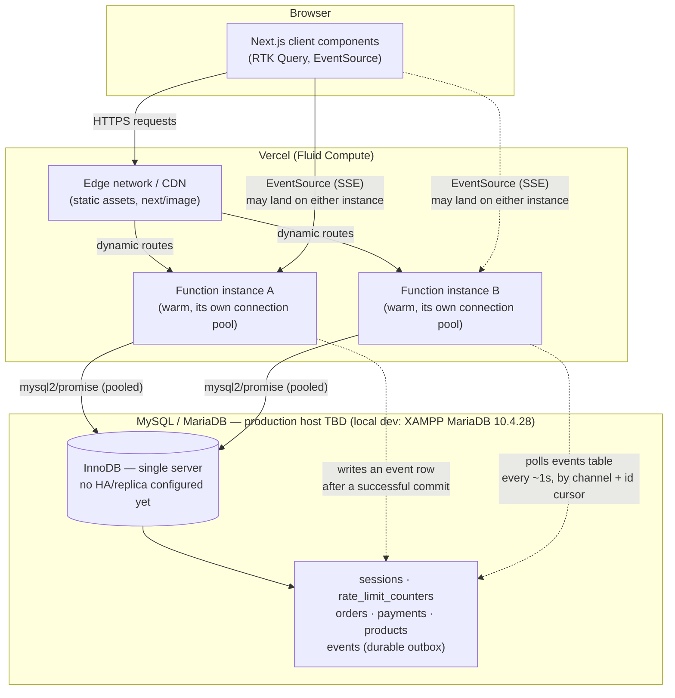

# Production Readiness — Architecture Decision Record

**Status:** Updated for the MongoDB -> MySQL/MariaDB migration. This
document describes the architecture this codebase actually implements
today, plus explicit, evidence-based decisions about what is deliberately
NOT implemented and why. It never describes a planned mechanism as already
deployed. Every claim below is either backed by code in this repository or
explicitly marked as requiring live verification (see the PENDING gates
list at the end).

**Migration note:** every database-layer claim in the original (Phase 11)
version of this document — MongoDB Atlas, replica sets, sharding,
Change Streams, TTL indexes — described a MongoDB architecture this app no
longer runs. The database is now MySQL/MariaDB (`sql/schema.sql`,
`config/db.js`, `mysql2/promise`). Local development runs against XAMPP's
bundled MariaDB 10.4.28. **No production MySQL host has been chosen or
provisioned yet** — this is the single biggest open item in this document
(see §6 and the PENDING gates list), unlike the original version, which
could at least assume Atlas.

## 1. Deployment platform

Confirmed production platform for the Next.js application itself:
**Vercel** (`tahostore.vercel.app`, see `.env.example`'s client-IP-trust
section) — this has NOT changed. This app runs as Next.js 16.3.4 App
Router Route Handlers — no custom Node/Express server, no Nginx, no custom
load balancer.

What HAS changed: the database this app talks to. Vercel does not host a
MySQL database itself — a separate managed MySQL/MariaDB provider (e.g.
PlanetScale, AWS RDS, DigitalOcean Managed MySQL, or a self-hosted
instance) must be chosen and provisioned before this app can run in
production. **This has not happened yet** — see §6.

## 2. Architecture classification table

| Concern | Mechanism | Where in this repo |
|---|---|---|
| Load balancing | Vercel-managed (automatic, platform-level) — no custom LB, no sticky sessions | N/A — see §3 |
| Compute scaling | Vercel Fluid Compute — reuses warm function instances across concurrent requests, not one-request-per-instance | Platform-level; `config/db.js`'s pool settings are tuned for this model |
| Function region | Single region, wherever the Vercel project is configured (not pinned in code) | See §4's region-alignment checklist |
| CDN | Vercel's edge network (static assets, `next/image` output) | Platform-level |
| App-level cache | `unstable_cache` + `revalidateTag`, MySQL-backed data reads | `lib/serverDataCache.js`, `lib/cacheInvalidation.js`, `lib/cacheTags.js` |
| Private/session state | MySQL-backed (`sessions` table), never in-memory/process-local | `models/sessionModel.js`, `lib/session.js` |
| Sessions | Opaque random tokens, MySQL-backed, HttpOnly/Secure/SameSite cookie | `lib/session.js`, `lib/cookies.js` |
| Rate limiting | MySQL-backed counters (`rate_limit_counters` table), shared across every instance | `models/rateLimitModel.js`, `lib/rateLimit.js` |
| Idempotency | Unique key on `(user_id, idempotency_key_hash)` — see `sql/schema.sql`'s `orders` table | `models/orderModel.js`, `lib/idempotency.js` |
| Realtime (SSE) | MySQL-backed durable event outbox (`events` table, `AUTO_INCREMENT` cursor) + bounded polling | `models/eventModel.js`, `lib/events.js`, `app/api/admin/events/route.js`, `app/api/orders/[id]/events/route.js` |
| Queue/broker | None installed — evidence-based "not required yet" decision | See §9 |
| DB topology | MySQL/MariaDB, InnoDB (real ACID transactions on a single standalone server — no replica-set-equivalent topology needed). Local dev: XAMPP MariaDB 10.4.28. **Production host: not yet chosen — PENDING.** | `config/db.js`, `sql/schema.sql` |
| Sharding | Not applicable at current scale — see §8 | N/A |
| Backups | Depends entirely on whichever production MySQL host is eventually chosen — most managed providers (PlanetScale, RDS, etc.) offer automated backups/PITR as a platform feature; none is configured because none is provisioned yet — PENDING | See §11 |
| Monitoring | Structured JSON logs with request-ID correlation; no external APM/tracing SDK installed | `lib/logger.js` |
| Deployment | Vercel Git-integration preview + production promotion (manual runbook, §12) | N/A |

## 3. Load-balancer decision

**Decision: no custom load balancer, no sticky sessions, no custom Nginx.**
Vercel provides load balancing and concurrency scaling at the platform
level for every deployed Function; building a custom layer on top would
duplicate what the platform already does and add a maintenance burden with
no benefit. Unchanged by the database migration.

This decision is safe specifically because **no per-instance state that
would require sticky sessions exists anywhere in this app**:

- **Sessions** are opaque tokens validated against MySQL on every request
  (`lib/session.js`'s `validateSessionToken`) — any instance can validate
  any session, because the state lives in the shared database, not in
  that instance's memory.
- **Rate limits** are MySQL-backed counters (`models/rateLimitModel.js`,
  an atomic `INSERT ... ON DUPLICATE KEY UPDATE` upsert) — a client's 3rd
  request landing on a different instance than their 1st and 2nd still
  sees the correct count.
- **Idempotency** keys are enforced via a MySQL unique key, not an
  in-memory dedup map — two concurrent requests with the same key landing
  on two different instances still race safely at the database layer
  (`services/orderService.js`'s `createOrder`, guarded by the unique key
  and a duplicate-key catch — `lib/idempotency.js`'s
  `isDuplicateKeyError()`).
- **Realtime (SSE)** is backed by the durable `events` table (§7) — every
  instance reads the same shared outbox, so no instance-local state is
  needed here either.

## 4. Region alignment checklist

Requires live confirmation against the real Vercel project AND whichever
MySQL host is eventually chosen (cannot be verified from this repository
alone — PENDING, see the gates list). The checklist itself, to run once
during/after deployment:

1. Identify the Vercel project's configured Function region(s) (Vercel
   dashboard → Project Settings → Functions → Region).
2. Identify the production MySQL host's region (its own dashboard —
   **never** by printing/inspecting connection credentials directly in
   any log or script output).
3. Confirm they match (or are in the same or an adjacent, low-latency
   region pair). A Function and its database in different regions adds
   real per-request latency to every single DB-backed route, since almost
   every route here touches MySQL.
4. Confirm this only needs checking once per deployment/region change,
   not per-request — nothing in this codebase re-resolves region at
   request time.

## 5. Function-duration inventory (long-lived / SSE routes)

| Route | Nature | Self-imposed close time | Reasoning |
|---|---|---|---|
| `app/api/admin/events/route.js` | SSE stream (admin broadcast) | 4 minutes (`STREAM_MAX_MS`) | Well under Vercel's 300s default function timeout; EventSource auto-reconnects, so a periodic clean close is invisible to the user and avoids ever being cut off mid-frame by the platform |
| `app/api/orders/[id]/events/route.js` | SSE stream (one order) | 4 minutes (`STREAM_MAX_MS`) | Same reasoning |
| Every other route | Ordinary request/response, no streaming | N/A | Bounded by normal request latency; nothing else in this app holds a connection open |

Live verification still required: confirm the actual configured Vercel
function-duration limit for this project (default vs. a raised limit) and
confirm 4 minutes stays comfortably under it — PENDING. Unaffected by the
database migration.

## 6. MySQL/MariaDB production readiness

### 6.1 Connection pooling (`config/db.js`)

`mysql2/promise`'s `createPool()`, sized for Vercel Fluid Compute's model:
each warm function instance holds its OWN cached pool
(`globalThis.__mysqlPoolCache`) for as long as it stays warm, so the right
sizing question is "how many concurrent in-flight requests can ONE warm
instance have," not "what's the app's total traffic."

- `connectionLimit: 20` (env-overridable via `DB_POOL_MAX`) — carried over
  as the starting point from the equivalent Mongoose pool-size reasoning
  (a conservative default with headroom for several concurrently-open SSE
  streams each polling the event outbox roughly once per second — §7);
  raising it requires real production connection-count evidence from
  whichever MySQL host is chosen, not speculation.
- `connectTimeout: 5000` ms — bounds a genuinely unreachable database to a
  fast, clear failure instead of hanging until the platform's own
  duration limit kills the request.
- `waitForConnections: true`, `queueLimit: 0` — a request that arrives
  when the pool is fully checked out queues (no artificial cap on the
  queue depth) rather than failing immediately; still bounded in practice
  by `connectTimeout`.

**Not yet measured against a real production MySQL host** — these values
are reasonable defaults carried over from the pre-migration architecture,
not numbers validated against real production connection-count metrics
(no such host exists yet to measure against) — PENDING.

### 6.2 Transaction readiness

InnoDB (this schema's storage engine — see `sql/schema.sql`'s own header
comment) supports real ACID multi-statement transactions on a single
standalone server by default. This app's multi-statement transactions
(order creation, COD payment creation, order cancellation, guarded stock
decrement, atomic coupon claims — all via `lib/db/tx.js`'s
`withTransaction()` in `services/orderService.js`/`services/paymentService.js`)
require no special server topology, unlike the old MongoDB replica-set
requirement. `scripts/checkReplicaSetReadiness.mjs` (the old check for
this) is deprecated — see that file's own header comment — there is
nothing MySQL-equivalent to check here beyond confirming the target host
actually runs InnoDB (the default engine for any modern MySQL/MariaDB
install; `sql/schema.sql` declares it explicitly per table regardless).

### 6.3 Index audit

Indexes are declared as static DDL directly in `sql/schema.sql` and
created once, when the schema is imported into a database (phpMyAdmin, or
the `mysql` CLI) — there is no MySQL-equivalent to Mongoose's
`autoIndex`/"ensure indexes at runtime" concept this app needs to guard
against. `scripts/auditIndexes.mjs` (the old runtime-ensure tool) has been
removed as genuinely obsolete for this reason — see the migration's own
delivery notes for the full reasoning.

**Known gap, not yet built:** a drift-detector — comparing a LIVE
database's actual `SHOW INDEX FROM <table>` output against what
`sql/schema.sql` currently declares, to catch a manually-altered table or
an outdated schema import — would be a legitimate new tool, but is new
tooling, not a conversion of anything that existed before, and was not
built as part of this migration.

### 6.4 Expiry cleanup — RESOLVED 2026-09-18 (script built, scheduling documented, not yet enabled)

MongoDB's TTL index automatically, physically deleted expired
`sessions`/`rate_limit_counters` documents in the background — no
application code was involved. **MySQL has no equivalent built-in
mechanism.** This app has always checked `expires_at` at READ time
(`lib/session.js`'s `validateSessionToken()` treats an expired session as
invalid before any cleanup ever runs; `lib/rateLimit.js`'s windowed
counters are scoped by a deterministic `window_start` and simply stop
being queried once their window has passed) — that correctness guarantee
was never in question. What was missing was the physical deletion itself.

**What was built:**

- **`lib/expiryCleanup.js`** — the testable core: `countExpired(queryFn,
  table)` (read-only) and `deleteExpiredInBatches(queryFn, table,
  { batchSize })`, which deletes in bounded batches (default 1000 rows;
  loops until a batch returns fewer than `batchSize` affected rows) using
  the existing `idx_sessions_expires_at` / `idx_rate_limit_expires_at`
  indexes (§6.3, `sql/schema.sql`). Safe to run repeatedly — an
  already-clean table simply deletes 0 rows.
- **`scripts/cleanupExpired.mjs`** — the CLI entry point:
  ```bash
  node --env-file=.env scripts/cleanupExpired.mjs              # deletes expired rows
  node --env-file=.env scripts/cleanupExpired.mjs --dry-run    # reports counts only, writes nothing
  ```
  Logs row counts only (`sessions: deleted N expired row(s)`,
  `rate_limit_counters: deleted N expired row(s)`) — never a `token_hash`,
  `csrf_token_hash`, `key_hash`, or any other column value. Exits 1 on any
  connection/query error, 0 otherwise, so a cron/launchd wrapper can alert
  on a non-zero exit without parsing output.
- **`tests/expiryCleanup.test.mjs`** — 15 tests against the real,
  disposable test database: expired rows deleted, active rows preserved,
  a ±2-second boundary case for each table, mixed expired+active exact
  counts, `countExpired` proven read-only and exactly matching what the
  real delete removes, bounded batching (10 rows against `batchSize: 3`,
  all removed, active row untouched), idempotent back-to-back runs, and
  (added on review, see below) two dedicated UTC-serialization
  round-trip tests. **15/15 pass.**

**A real, verified bug found and fixed along the way — timezone skew in
`NOW()` comparisons:** this app's local MySQL/MariaDB instance has
`time_zone` set to `SYSTEM`, and the system's own timezone is **not**
UTC (`Asia/Dhaka`, UTC+6) — confirmed directly via `SELECT
@@session.time_zone, NOW(), UTC_TIMESTAMP(), @@system_time_zone;`, which
returned `SYSTEM | 2026-09-18 12:40:06 | 2026-09-18 06:40:06 | +06`. Every
`expires_at`/timestamp column this app writes is stored as UTC
(`config/db.js`'s pool sets `timezone: "Z"`), so **any SQL-side
comparison of a stored column against MySQL's own `NOW()`/`NOW(3)` is
wrong by the server's own UTC offset.** This is not a hypothetical —
it's how MongoDB's TTL index worked (server-side, UTC-only) and is easy
to silently carry over as `WHERE expires_at < NOW()` when translating
Mongo TTL logic to SQL.

`lib/expiryCleanup.js` was written from the start using a JS-computed,
parameterized cutoff (`expires_at < ?`, `[new Date()]`) rather than SQL
`NOW()`, mirroring the pattern `lib/session.js`'s `validateSessionToken()`
already used safely. Auditing the rest of the codebase for the same
`NOW()`-comparison pattern (`grep -rn "NOW(" models/ services/ lib/
scripts/`) found two more real instances of the identical bug, both now
fixed the same way:

- **`models/sessionModel.js`'s `findActiveIdsByUser()`** — used by
  `pruneExcessSessions()` to decide which of a user's sessions are
  "active" when enforcing `MAX_SESSIONS_PER_USER`. Was `expires_at >
  NOW(3)`; now `expires_at > ?` bound to `new Date()`.
- **`models/couponModel.js`'s `buildAdminWhere()`** — the admin
  coupon-list "active"/"expired" status-pill filter. Was `expires_at >=
  NOW(3)` / `expires_at < NOW(3)`; now parameterized the same way. (Actual
  coupon-redemption validity was never affected — `Coupon.isValid()`
  already compared `expiresAt` against a JS `new Date()` — only this
  admin-list display filter had the bug.)

Writes of the form `SET some_column = NOW(3)` (session `last_seen_at`,
`revoked_at`; cart/wishlist `updated_at`; payment `paid_at`; notification
`read_at`) were **deliberately left as-is** — a write is never compared
against a stored value, so the timezone offset has no correctness impact
there, only on later reads that (correctly) go through `config/db.js`'s
`timezone: "Z"` driver conversion back to a UTC-aware JS `Date`.

**Confirmed consistent with the actual mysql2 client configuration and
column types (added on review, 2026-09-18), not just inferred from
boundary behavior passing:** `config/db.js`'s pool sets `dateStrings:
false, timezone: "Z"` — mysql2's own client-side setting, independent of
the MySQL server's session `time_zone` — which means every JS `Date`
bound as a query parameter is serialized to the wire using that `Date`'s
real UTC instant, and every `DATETIME(3)` column read back is parsed
into a JS `Date` under the same UTC assumption. `expires_at` on both
`sessions` and `rate_limit_counters` is `DATETIME(3)` (`sql/schema.sql`)
— a type with no timezone of its own, meaningful only relative to
whatever convention writer and reader agree on, which here is mysql2's
client-side `timezone: "Z"`, never the server's own session `time_zone`.
Two new tests in `tests/expiryCleanup.test.mjs` make this explicit rather
than only inferable from the ±2-second boundary tests passing:
1. a JS `Date` bound as `expires_at` round-trips back out of storage
   within 1 second of the original value (network + `DATETIME(3)`
   millisecond-rounding tolerance only);
2. the round-tripped value is cross-checked against the database
   **server's own** `UTC_TIMESTAMP(3)` (an authority independent of both
   this test process's clock and the server's local `time_zone`) and
   matches within 3 seconds — while the SAME row's `NOW(3)` (server
   local time) diverges from that same `UTC_TIMESTAMP(3)` by the real,
   large SYSTEM-timezone skew this whole fix exists to route around
   (confirmed >30 minutes apart on this environment — in practice the
   full ~6 hours). This is the test that would have caught the original
   bug directly, not just observed its symptom.

All directly-relevant tests re-run clean after both fixes:
`tests/session.test.mjs` + `tests/coupons.test.mjs` +
`tests/expiryCleanup.test.mjs` together — **69/69 pass** — and the full
main suite — **1235/1235 pass**, all verified 2026-09-18.

**Confirmed: expired sessions are rejected at authentication even when
cleanup has never run (no new code needed — pre-existing, already
covered by a real HTTP test).** `lib/session.js`'s
`validateSessionToken()` rejects a session purely from its own row
(`session.revokedAt` / `session.expiresAt <= new Date()`) — it never
checks whether a cleanup job has deleted anything, so an expired-but-
undeleted row is already 100% unusable for authentication regardless of
`scripts/cleanupExpired.mjs`. This is exercised end-to-end, against a
real running server, by
`tests/http/authSessionCsrfSse.integration.test.mjs`'s "an expired
session with an otherwise-valid CSRF pair fails with 401 (not 403)"
test: it force-expires a real session row via a raw `UPDATE ... SET
expires_at = <1 second ago>` (the row is left physically in place — no
delete, no cleanup job involved), then makes a real authenticated
request and asserts `401`. Part of the full HTTP suite — passing in both
2026-09-18 runs below.

**Scheduling — for this machine (macOS/Darwin, local XAMPP MariaDB on
port 3307) — documented only, NOT enabled**, per this task's explicit
instruction not to turn on an OS-level scheduled task automatically:

*Option A — `launchd` (native macOS, recommended: survives reboots, has
built-in logging)*

Create `~/Library/LaunchAgents/com.leo-multi-ecomm.cleanup-expired.plist`:

```xml
<?xml version="1.0" encoding="UTF-8"?>
<!DOCTYPE plist PUBLIC "-//Apple//DTD PLIST 1.0//EN"
  "http://www.apple.com/DTDs/PropertyList-1.0.dtd">
<plist version="1.0">
<dict>
  <key>Label</key><string>com.leo-multi-ecomm.cleanup-expired</string>
  <key>ProgramArguments</key>
  <array>
    <string>/usr/local/bin/node</string>
    <string>--env-file=.env</string>
    <string>scripts/cleanupExpired.mjs</string>
  </array>
  <key>WorkingDirectory</key><string>/Users/tahoshinislam/leo-multi-ecomm</string>
  <key>StartCalendarInterval</key>
  <dict>
    <key>Hour</key><integer>3</integer>
    <key>Minute</key><integer>0</integer>
  </dict>
  <key>StandardOutPath</key><string>/tmp/leo-multi-ecomm-cleanup-expired.log</string>
  <key>StandardErrorPath</key><string>/tmp/leo-multi-ecomm-cleanup-expired.err.log</string>
</dict>
</plist>
```

Then, when ready to actually enable it (not run as part of this task):

```bash
which node   # confirm /usr/local/bin/node is correct for this machine — replace in the plist if not
launchctl load ~/Library/LaunchAgents/com.leo-multi-ecomm.cleanup-expired.plist
```

To later disable: `launchctl unload
~/Library/LaunchAgents/com.leo-multi-ecomm.cleanup-expired.plist`.

*Option B — `cron` (simpler, no reboot-persistence guarantees on macOS
unless Full Disk Access is granted to `cron`/`cronjob` in System
Settings → Privacy & Security)*

```bash
crontab -e
# add (daily at 3:00 AM):
0 3 * * * cd /Users/tahoshinislam/leo-multi-ecomm && /usr/local/bin/node --env-file=.env scripts/cleanupExpired.mjs >> /tmp/leo-multi-ecomm-cleanup-expired.log 2>&1
```

Either way: XAMPP's MariaDB (port 3307 per `.env`) must be **running** at
the scheduled time, since `scripts/cleanupExpired.mjs` connects via the
same `config/db.js` pool the app itself uses — if XAMPP isn't running,
the script exits 1 (connection error) and the next scheduled run simply
tries again with a larger backlog; no data is lost either way, since this
is purely a storage-reclamation backstop, never relied on for
authentication or rate-limit correctness (see above).

**Neither the `launchd` plist nor the `cron` entry has been installed or
enabled** — this section documents how to, for the user's own decision.

## 7. Distributed realtime

`lib/events.js` is a MySQL-backed durable event outbox (`events` table,
`models/eventModel.js`) — the SQL port of the same Phase 11 design the
original MongoDB version implemented (a process-local `EventEmitter` is
broken by construction under Vercel Fluid Compute, since multiple isolated
function instances share no process memory). `lib/events.js` keeps the
exact same public function names (`emitOrderEvent`, `emitAdminEvent`,
`orderChannel`, `ADMIN_CHANNEL`).

**Transactional outbox (3 mutations: order creation, order cancellation,
COD payment creation).** The event row is now inserted *inside* the same
`withTransaction(...)` block (`lib/db/tx.js`) as the business mutation,
via `emitOrderEvent(...)`/`emitAdminEvent(...)`'s optional `{ conn }`
parameter. This is a genuine transactional outbox for these three: a
forced event-insert failure rolls back the whole transaction (order/stock/
coupon/cart writes included — proven in
`tests/eventDurabilityAtomicity.test.mjs`), and a successful transaction
commits the mutation and its event atomically, in the same instant.
InnoDB's own transaction isolation makes an uncommitted event row
invisible to other readers until commit, so "expose the event only after
commit" is automatic, the same guarantee the old MongoDB version relied on.

**Non-transactional, best-effort (the remaining call sites — product
create/update, new-review admin notification, order-status-change
notifications, the post-commit low-stock check).** These mutations are
single-row writes or have no transaction to join. Each event write is
awaited via `emitBestEffort()` before the calling function returns — a
failure is guaranteed to be observed and logged (`lib/logger.js`'s
`logEvent`, no secrets, no stack trace in the structured line) before the
response returns, never silently lost to a frozen/recycled function
instance — but a failure here does NOT roll back or fail the
already-succeeded business mutation, since every one of these event types
has a documented, low-severity, self-healing loss consequence (§9's
async-work table): a live admin/customer view stays stale until the next
poll/refresh, nothing is ever silently wrong.

**Background-execution API audit:** this app does not use `waitUntil()`,
Next.js's `unstable_after()`, or any other background-execution API
anywhere in the codebase. The only `@vercel/functions` import
(`ipAddress()` in `lib/clientIp.js`) is for client-IP resolution,
unrelated to background execution. The atomicity guarantee for the 3
transactional call sites comes entirely from the InnoDB transaction
itself, which is durable across a function instance being frozen or
recycled at any point.

**Change Streams equivalent — not applicable to MySQL.** The original
MongoDB version of this document compared bounded polling against MongoDB
Change Streams and chose bounded polling. MySQL's closest equivalent
(binlog-based CDC — e.g. Debezium) carries the same or greater operational
complexity for this app's actual usage (a handful of admin dashboards,
individual customers watching their own order) — a 1-second bounded poll
against an indexed `(channel, id)` query remains the simpler choice, and
was never changed by the migration. Reconsider only with real evidence of
high concurrent open-stream volume — not speculatively.

**Guaranteed properties (each with a mandatory cross-process test — see
§13 and `tests/http/multiInstanceEvents.integration.test.mjs`):**

- Cross-instance visibility: an event committed via one real server
  process is delivered to a stream held open by a genuinely separate
  process (proven, not asserted).
- Permission protection preserved: unauthenticated and non-owner requests
  are rejected before the stream opens.
- Minimal payloads: the event schema doesn't send more data than any call
  site needs.
- Events only after successful commits: for the 3 transactional call
  sites, the event is part of the same transaction as the commit itself
  (proven in `tests/eventDurabilityAtomicity.test.mjs` by forcing the
  event insert to fail and confirming the business mutation rolls back
  too). For the non-transactional sites, the write is awaited via
  `emitBestEffort()` and always happens strictly after the mutation that
  already succeeded.
- No duplicate events on idempotent replay: proven both via mocked
  call-count evidence (`tests/orderPostCommitEffects.test.mjs`) and real-
  database row counts for sequential AND concurrent replay
  (`tests/eventDurabilityAtomicity.test.mjs`) — a replayed
  `Idempotency-Key` request returns the same order without inserting a
  second `NEW_ORDER` event row.
- `Last-Event-ID` resume: the server emits `id: <auto-increment id>` per
  SSE frame; the browser's native `EventSource` tracks and resends it
  automatically on reconnect; the server's `resolveStartCursor()` honors
  it with a strict `id > lastSeenId` query, so a resumed connection never
  redelivers an already-seen event.
- Expiry: `expires_at` (10 minutes from creation) — see §6.4 above for why
  this is currently checked-at-read-time only, not physically deleted the
  way MongoDB's TTL index did (a real, flagged gap).
- Heartbeats: unchanged `: ping\n\n` comment every 25s, carrying no data.
- Streams close before the configured Vercel duration: self-imposed
  4-minute close (§5).
- Client-side dedup: both hooks (`hooks/useAdminEventStream.js`,
  `hooks/useOrderStatusStream.js`) track a small bounded set of recently
  seen `lastEventId` values as defense-in-depth on top of the server's own
  guarantee.

## 8. Sharding / horizontal-scaling decision

**Decision: not sharded, and not applicable at current scale.** MySQL doesn't "shard" in
the same built-in sense MongoDB Atlas does — horizontal write-scaling for
MySQL means either application-level sharding (multiple independent
databases, routed by key) or a specialized distributed-MySQL product
(Vitess, PlanetScale's own sharding). Neither is remotely justified by
this app's current traffic.

Concrete risk factors that make any form of horizontal DB scaling a bad
default choice right now, not merely an unnecessary one:

- **Multi-statement order transactions**: order creation, COD payment
  creation, cancellation, and stock decrement all run inside
  `withTransaction`. Cross-shard transactions (under any sharding
  approach) carry materially higher latency and a more complex failure
  surface than a single InnoDB server — a real cost this app's current
  traffic does not justify paying.
- **No natural shard key**: none of `orders`, `products`, `users`, etc.
  has an obvious, evenly-distributing shard key that also keeps
  transaction-scoped rows (e.g. an order and the stock decrements it
  triggers) co-located — choosing a bad shard key is far worse than not
  sharding at all, and is expensive to change later.
- **Premature for an unprovisioned production database**: this app
  doesn't have a production MySQL host yet (§6) — evaluating sharding
  before even choosing a single-server production host is solving a
  problem two scale-tiers away from the current one.

**Explicit future thresholds** (any of these being true is the trigger to
re-evaluate, not sharding pre-emptively):

- Working-set size or write throughput approaching the practical ceiling
  of the largest single-server tier the chosen MySQL host offers.
- Read/write latency on core tables (`orders`, `products`) measurably
  degrading under real production load even after standard optimization
  (index review, read replicas where the chosen host supports them).
- A genuine multi-region write requirement a single primary cannot serve
  acceptably.

## 9. Async / background work inventory

| Work | Must complete before response? | Retried on failure? | Idempotency key needed? | Duplicate/loss consequence | Current volume | Queue required now? |
|---|---|---|---|---|---|---|
| Password-reset email | No (fire-and-forget in practice via nodemailer's own promise; caller doesn't block the enumeration-safe response on it) | No | No — token itself is single-use | Loss: user doesn't get the email, requests another (low friction). Duplicate: harmless, just two identical emails | Low | No |
| Admin notification (DB write) | No | No | No — a missed notification is a UX gap, not a correctness bug | Loss: an admin doesn't see a bell notification (recoverable — the underlying data is still correct and visible in the relevant list page) | Low-medium | No |
| Order/admin realtime events (durable outbox) | No | No (next poll cycle just sees the next real state) | Implicitly, via the same idempotency key that guards the underlying order/payment operation | Loss: a client's live view is stale until their next poll tick or manual refresh (never wrong data, just delayed) | Low-medium | No |
| Low-stock check | No | No | No — re-checking stock is idempotent by nature (it's a read against current state) | Loss: a low-stock alert is delayed until the next order touches that product | Low | No |
| Cache invalidation (`revalidateTag`) | No (called after the response-relevant work, fire-and-forget) | No | N/A — invalidation is idempotent (tagging a cache key as stale twice is a no-op) | Loss: stale cache read until the tag's own TTL expires | Low-medium | No |
| Session/rate-limit expiry cleanup | **Not automated — see §6.4, a real gap** | N/A | N/A | Unbounded table growth if never addressed | N/A | No (but a scheduled cleanup job is needed — see §6.4) |

**Conclusion: no message queue/broker required at this app's current
scale.** Every asynchronous unit of work above is either safely
fire-and-forget (its failure has a low-severity, self-healing consequence
already documented) or backed by MySQL's own transactional guarantees
(unique-key idempotency). The one exception — expiry cleanup — needs a
scheduled job, not a queue/broker; see §6.4. No queue/broker (Vercel
Queues or otherwise) is installed, and none should be added without
explicit authorization.

**Explicit future adoption thresholds** — reconsider only if one of these
becomes true:
- A background job's failure would need automatic retry with backoff that
  fire-and-forget + "next request/poll heals it" can no longer cover.
- Real operational evidence of email delivery failures going unnoticed at
  a volume that matters.
- A new async workload is added whose consequence-of-loss is high (e.g. a
  payment-provider webhook that must not silently drop).

## 10. Cache guarantees reconfirmation

`unstable_cache` + `revalidateTag` (`lib/serverDataCache.js`) is unchanged
in mechanism by the database migration — it caches the RESULT of a MySQL
read the same way it cached the result of a MongoDB read. Cache
invalidation call sites (`lib/cacheInvalidation.js`) were re-verified
during the migration to still fire on the same create/update/delete
operations, now backed by SQL writes instead of Mongoose saves.

**Local vs. live verification split** (the split below is about what
still needs confirming against the REAL deployed environment, once one
exists):

- Verifiable locally (already proven in this repo's own test suites): tag
  invalidation correctness, TTL expiry timing, that a write-path mutation
  calls `invalidateCacheTags()` for the right tags.
- Requires live verification (cannot be proven from a local `next start`
  process alone — PENDING): whether Vercel's own data-cache persistence
  behaves identically to local disk-backed `.next/cache` across multiple
  deployed instances and across a redeploy; whether the CDN layer in front
  of a Vercel deployment caches any of these responses at an additional
  layer this app's own tags don't reach.

**Safe (not executed) preview verification procedure**, for a future
manual pass against a real Preview deployment: (1) load a page backed by a
cached read, note the response; (2) perform the admin mutation that should
invalidate that tag; (3) reload the same page within a few seconds and
confirm the updated data appears; (4) repeat once more after redeploying
the same Preview, to confirm invalidation survives a redeploy. This
procedure is deliberately read/write-safe against a Preview environment
only — it is not run against production, and it is not run as part of
this document.

## 11. Backup / PITR plan and restore drill

**Plan: cannot be finalized until a production MySQL host is chosen
(§6) — this is the single largest PENDING item in this whole document.**
The original MongoDB version of this section could describe a specific
plan (Atlas continuous backup/PITR) because Atlas was already the
confirmed production database. No equivalent confirmed choice exists for
MySQL yet. Once a host is chosen, this section needs to be rewritten
specifically for that provider's real backup mechanism — the options
differ materially:

- A managed provider with built-in PITR (e.g. PlanetScale, AWS RDS with
  automated backups enabled) — the provider handles this, and this
  section becomes "confirm it's enabled and record the actual RPO/RTO the
  provider documents," much like the original Atlas version.
- A self-hosted MySQL/MariaDB instance — nothing is provided
  automatically; this app would need its own backup strategy (e.g.
  `mysqldump` + binlog archiving on a schedule, restore-tested
  periodically) built and documented from scratch.

**Restore-drill procedure (generic — adapt once a specific host is
chosen; run against a throwaway database, never over production):**

1. Provision a separate, temporary database (or use the chosen provider's
   own "restore to a new instance" flow, which never restores over
   production and never touches the source database/cluster).
2. Trigger a restore to a specific point in time a few minutes in the
   past, targeting ONLY the temporary database.
3. Import `sql/schema.sql` if the restore mechanism doesn't already
   include the schema, then spot-check: expected tables exist, a
   spot-checked row matches what was known to be true at that timestamp,
   `SHOW INDEX FROM <table>` matches what `sql/schema.sql` declares.
4. Tear down the temporary database once the drill is confirmed.
5. Record the actual wall-clock time the restore took — this becomes the
   evidence basis for a real RTO figure, not a guess.

**RPO/RTO: cannot be proposed yet** — both depend entirely on which
production host is chosen and that host's own backup granularity/restore
speed. Do not treat any number in the original (Atlas-era) version of this
document as still applicable.

## 12. Incident-response plan and deployment/rollback runbook

### Incident response

**Severity levels:**
- **SEV1** — production down or data-integrity risk (e.g. payment/order
  data corruption, auth bypass). Immediate response.
- **SEV2** — a significant feature broken (e.g. checkout failing for a
  subset of users, realtime events not delivering) but the app is
  otherwise usable.
- **SEV3** — a minor, non-blocking issue (e.g. a cosmetic bug, a slow but
  functioning endpoint).

**Detection:** Vercel's own deployment/function error rate (dashboard),
the chosen MySQL host's own health/alerting (once one exists — PENDING),
and user/support reports.

**Triage:** confirm severity, confirm blast radius (one route? every
route? one region?), check `/api/health/ready` and `/api/health/live`
first — they distinguish "the app process is fine but the database is
degraded" from "the app itself is down."

**Containment:** for a bad deploy, roll back via Vercel's instant rollback
to the last known-good production deployment (the rollback runbook below)
rather than attempting a forward-fix under pressure.

**Credential rotation:** if a credential (the database connection
password, Cloudinary
secret, SMTP password) is suspected compromised, rotate it in the real
secrets store (Vercel environment variables / the MySQL host's own user
management) and redeploy — this codebase never hardcodes a credential, so
rotation is purely an ops/dashboard action, not a code change.

**Rollback:** see the deployment runbook below.

**DB recovery:** see §11's restore-drill procedure (once a production host
exists to run it against).

**Communication owner:** not specified in this codebase — this is an
organizational decision for whoever owns the real production deployment.

**Post-incident review:** a short written summary (what happened, what
was the trigger, what was the fix, what would have caught it sooner) —
process, not code; no template is prescribed here.

### Deployment / rollback runbook

**Before-preview checklist:**
1. `npm run lint` — 0 problems.
2. `CI=true REQUIRE_TEST_DB=true npm run test:core` — all pass.
3. `CI=true REQUIRE_TEST_DB=true npm run test:http` — all pass (this
   itself runs `npm run build` first via its `pretest:http` hook).
4. `npm run validate:production` — 0 problems, run with the REAL target
   environment's variables loaded (never with test/local values). Checks
   `DB_HOST`/`DB_PORT`/`DB_NAME`/`DB_USER` shape, not just the old
   `MONGO_URI` — see `scripts/validateProductionEnv.mjs`.
5. `npm audit --omit=dev` — no new unaddressed vulnerabilities since the
   last review.

**Preview verification steps** (once Vercel's Git integration produces a
Preview URL, and once a Preview-tier MySQL database exists to point it
at):
1. Confirm `/api/health/live` and `/api/health/ready` both return 200.
2. Manually verify the specific feature(s) this deploy changes.
3. Run `scripts/smokeDeployment.mjs` (read-only mode) against the Preview
   URL.
4. If this deploy touches cache-tagged data, run §10's cache verification
   procedure against the Preview.

**Production promotion steps:**
1. Promote the verified Preview deployment to Production via Vercel's
   "Promote to Production" action (never a fresh production build from a
   possibly-different commit).
2. Re-run `/api/health/ready` and `/api/health/live` against the real
   production URL.
3. Watch Vercel's function error-rate dashboard for a few minutes.

**Rollback steps:**
1. Vercel Dashboard → Deployments → select the last known-good production
   deployment → "Promote to Production" (Vercel's instant rollback — no
   rebuild required).
2. Confirm `/api/health/ready` on production afterward.
3. If the bad deploy included a destructive DB migration/schema change,
   rolling back the app code does NOT roll back the database — that
   requires the restore-drill procedure (§11) or a manually reasoned
   forward-fix, decided case-by-case. `sql/schema.sql` is additive-only by
   design (every statement is `CREATE TABLE IF NOT EXISTS`), so an
   ordinary schema re-import is always safe, but a manual `ALTER
   TABLE`/data change outside that file is not covered by this guarantee.

## 13. Recommended (not configured) monitoring/alerts

Documented only — nothing below is wired up, since doing so requires
access to the real Vercel dashboard and whichever MySQL host's own
dashboard is eventually chosen:

- Vercel: function error-rate alert, function duration p95/p99 alert
  (catches an SSE stream or any route trending toward the platform's
  duration limit), deployment-failure notification.
- MySQL host (once chosen): CPU/connection-count alerts (validates the
  pool-size formula in §6.1 against real numbers), disk-usage alert,
  replication-lag alert if a read replica is ever added.
- Application-level (via the structured logs `lib/logger.js` now emits):
  an aggregation/alerting rule on `category: "DEPENDENCY_UNAVAILABLE"` or
  `category: "TIMEOUT"` log events trending upward — these are exactly the
  categories `/api/health/ready` failures and rate-limit-store outages
  fall into.

## 14. Live-verification gates — PENDING

None of the following may be marked PASS from local evidence alone. Every
one requires an action against a real, live deployment:

1. **A production MySQL/MariaDB host is chosen and provisioned.** Nothing
   else in this section can be completed until this happens — it is the
   actual blocker, not an oversight.
2. Vercel Function region matches the production MySQL host's region (§4).
3. Vercel project's actual configured function-duration limit, confirmed
   ≥ the 4-minute self-imposed SSE close time (§5).
4. `npm run validate:production` run against the REAL production
   environment variables (never against `.env.test`/local values).
5. A production-appropriate index audit: confirm `sql/schema.sql` was
   imported into the production database and `SHOW INDEX FROM <table>`
   matches what it declares.
6. The chosen MySQL host's backup/PITR mechanism actually enabled and
   confirmed on the production database (§11).
7. A real restore drill executed against a temporary database (§11), with
   actual timing recorded.
8. `scripts/smokeDeployment.mjs` executed against a real Preview
   deployment URL.
9. `scripts/smokeDeployment.mjs` executed against the real production URL
   post-promotion.
10. Cache verification procedure (§10) executed against a real Preview
    deployment.
11. Vercel function error-rate/duration alerts actually configured (§13).
12. MySQL host health/alerts actually configured, once a host exists
    (§13).
13. A real multi-region latency check, if the production Vercel project
    ever spans more than one Function region.
14. Confirmation that `TRUST_PROXY_HEADERS`/`TRUSTED_PROXY_HOP_COUNT` are
    correctly left unset in the real Vercel production environment (Vercel
    IP resolution is automatic — see `.env.example`'s client-IP-trust
    section — these must NOT be set there).
15. A real rollback executed at least once (even in a Preview/staging
    context) to confirm the runbook (§12) works as written, not just as
    designed.
16. SMTP credentials confirmed to actually deliver a real password-reset
    email end-to-end against the real production SMTP provider.
17. A scheduled expiry-cleanup job for `sessions`/`rate_limit_counters`
    is built and running (§6.4) — MySQL does not do this automatically
    the way MongoDB's TTL index did. **Partially resolved 2026-09-18**:
    the script (`scripts/cleanupExpired.mjs`) exists, is tested (13/13),
    and its `launchd`/`cron` scheduling is documented in §6.4 — but it is
    **not yet installed/enabled** on any machine, by design (this was a
    local-dev task, not a production deployment action). Still PENDING
    until actually enabled on whichever host runs scheduled jobs in
    production.

## 15. Architecture diagram



## 16. HTTP integration test flake — root cause and fix (resolved 2026-09-18)

**Symptom:** `tests/http/serverCacheBehavior.integration.test.mjs`'s "a
failed (validation-rejected) product update does not invalidate the
cache" test intermittently failed when run as part of the full HTTP
suite (particularly alongside `tests/http/productFilters.integration.test.mjs`),
but passed reliably in isolation — a classic test-order-dependent flake,
not a deterministic failure.

**Investigated and ruled out:**
- A literal cache-key collision between `/api/products` and `/shop`
  (both go through `getCachedProductList()` / `getShopCacheKey()` in
  `lib/shopCacheEligibility.js`) — `productFilters`' own queries never
  actually produced the same cache key as the failing test's fixture.
- Fixture cleanup / test isolation ordering between the two files —
  `truncateAll()` and per-test fixture setup were confirmed correct.

**Actual root cause (confirmed by reading Next.js's own source, not
inferred):** Next's `unstable_cache()` — see
`node_modules/next/dist/esm/server/web/spec-extension/unstable-cache.js`
— on a cache MISS computes the result and returns it to the caller
**immediately**, but stashes the actual cache-store write
(`cacheNewResult()`) in `workStore.pendingRevalidates[invocationKey]`, a
promise the framework's own request lifecycle is responsible for
awaiting **later** — not something guaranteed to have resolved by the
time the HTTP response has finished sending. A plain `await fetch(url)`
resolves once response **headers** arrive (before the body, let alone
this pending write, is done); draining the body via `.text()` closes
most of that gap but not all of it — confirmed empirically: instrumenting
both sides showed cases with under 2ms between a body-drained "warm" read
and a following raw SQL write, occasionally enough for the write to land
before the cache entry had actually finished being persisted, corrupting
a test's "warm, pre-existing" cached snapshot. There is no public Next.js
API to await a specific `pendingRevalidates` entry from outside the
request that created it.

**Iteration history — kept because each dead end is informative, not
just the ending:**

1. **A fixed 100ms delay.** Closed the race in practice; a guess, not a
   proof.
2. **Polling `.next/cache/fetch-cache`'s directory-wide mtime for
   quiet.** Correctly flagged on review as a **heuristic, not
   deterministic synchronization**: it observed whether the DIRECTORY
   was idle, not whether THIS request's entry was ready — a
   silently-uncached endpoint would look identical to a freshly-settled
   one. Reclassified honestly rather than kept under a "deterministic"
   label it didn't earn.
3. **Requiring an observed directory-wide delta before accepting
   "settled".** Closed gap 2's blind spot, but proved to be the wrong
   invariant: this describe block's `burqaDeptId` is fixed, and several
   tests intentionally/structurally share a canonical `category=<id>&...`
   query key with an adjacent test — a later test's warm-up call can
   correctly be an inherited HIT with nothing new to write. A
   directory-wide delta can't distinguish "our key" from "some other
   key", so it threw on legitimate hits.
4. **A directory-wide churn-relative-to-last-poll variant**, accepting
   either an immediate hit or a settled miss. Still directory-scoped, so
   still fundamentally a heuristic — it could not prove a write (or its
   absence) was for the SPECIFIC key/route the request cared about, only
   that the directory as a whole had gone quiet. **This is the version
   correctly identified on further review as still not deterministic
   per-key synchronization**, prompting the final redesign below.

**Final mechanism — deterministic, per-key, test-only synchronization in
the server process itself (not a filesystem heuristic):** the test
server (`scripts/httpTestServer.mjs`, TEST-ONLY — never the production
build or a real deployment) is started with `NEXT_PRIVATE_DEBUG_CACHE=1`,
Next's own internal switch
(`node_modules/next/dist/server/lib/incremental-cache/file-system-cache.js`'s
`FileSystemCache.debug`). Reading that file directly confirms every
`if (FileSystemCache.debug)` block wraps only a `console.log` call and
nothing else — this changes zero cache read/write/timing behavior, in a
process that is itself test-only. Those log lines name the exact cache
key, its tags, and whether a lookup found an entry, e.g.:

```
FileSystemCache: get ddbe0ed9...afe300 [ 'catalog' ] FETCH false
FileSystemCache: set ddbe0ed9...afe300
```

`scripts/httpTestServer.mjs` exposes that running server's log file path
via `HTTP_TEST_SERVER_LOG_PATH`. Under this harness's own
`--test-concurrency=1` (confirmed in that script), no two requests are
ever in flight at once. The test file reads NEW log content since a
byte-offset captured right before firing each request and parses the
`get`/`set` lines, correlating by the **exact key string** Next itself
logs — not by timing, not by directory mtime, and not by trying to
replicate Next's cache-key hash independently.

Three distinct primitives replace the single, overloaded `warmCache()`,
because "prove a fresh write happened", "prove this was already warm",
and "prove this is now durable, whichever way" are three different
claims that were previously conflated:
- **`warmCacheMiss(url, opts, { tag })`** — asserts a `get` tagged `tag`
  (from `lib/cacheTags.js` — `"catalog"`, `"categories"`,
  `"admin-analytics"`, matching whichever `unstable_cache()` call the
  route under test actually uses) has a matching `set` for the SAME key.
  Use for a genuine first touch, or a touch immediately following a real
  invalidating mutation with nothing else intervening.
- **`confirmCacheHit(url, opts, { tag })`** — asserts every `tag`-tagged
  `get` in the window has NO matching `set` at all. Use ONLY where the
  call is KNOWN — by tracing actual test order and invalidation, not
  assumed — to reuse an entry an earlier `warmCacheMiss()` in the same
  test run already established, with nothing invalidating it in between.
- **`ensureCacheReady(url, opts, { tag })`** — accepts either outcome
  (a settled write, or a stable hit with nothing pending) as success.
  Use when the caller genuinely doesn't need to know or assert which
  happened — only that the entry is durable before a following mutation.

All three throw with the **full captured cache-activity log slice** on a
genuine timeout — none of them ever falls back to a fixed delay, per
explicit instruction. A silent fallback would hide exactly the failure
mode (a write that never lands, or lands when it shouldn't) these exist
to catch.

**Two real bugs found by investigating actual captured failures — not
by adjusting timing:**

1. **A real classification bug, not a timing issue.** The very first
   version of `warmCacheMiss` treated the debug log's `get ... false`
   as "this is a miss" and `get ... true` as "this is a hit, no write
   coming" — WRONG. Reading `file-system-cache.js`'s `.get()` closely: a
   `true` (an entry WAS found) can still have its `combinedTags` expired
   (`areTagsExpired()`), in which case `.get()` logs `FileSystemCache:
   expired tags [...]` on the very next line and returns `null` anyway —
   the caller recomputes and calls `.set()` regardless. A real captured
   run showed exactly this: `get ... true` → `expired tags [...]` →
   `set` for the same key — a genuine write my `hit === false` filter
   was silently excluding, causing a false "0 miss keys observed"
   timeout. **Fix:** stopped using the boolean to decide "did a write
   happen" at all — a `set` is unambiguous proof by itself, whatever
   preceded it.
2. **An invariant that only held for a 2-file slice, not the full
   suite.** After fixing (1), the two-file `productFilters` +
   `serverCacheBehavior` pair ran clean, but one **complete, single,
   fully-captured** `npm run test:http` run (all ~20 HTTP test files)
   showed "category rename..." throwing `warmCacheMiss(): Observed 1
   get(s) tagged "categories", 0 with a completed matching set()`. Not a
   flake, not a timing issue — the full log slice showed a clean, stable
   `get ... true` with nothing else: `/api/categories` had genuinely
   already been warmed by an earlier file in the full suite before this
   describe block even started, something the 2-file slice could never
   have shown. That test's own assertions only ever check state AFTER
   its mutation — never whether the warm-up itself was a hit or a miss —
   so requiring a fresh write was stricter than the test actually needed.
   **Fix:** that one call site now uses `ensureCacheReady()` instead of
   `warmCacheMiss()` — the only call site changed for this reason; every
   other `warmCacheMiss()`/`confirmCacheHit()` call kept its original,
   traced classification because the full-suite run confirmed those
   assumptions held.

**On whether this is a known Next.js defect:** searched for a filed
Next.js issue naming the underlying `pendingRevalidates`-not-awaited
behavior and found none matching it. Documented as **observed,
source-confirmed behavior in this installed version (16.3.4)**, not a
claim that it is a recognized/tracked framework defect — Next.js may
consider compute-then-persist-in-background an intentional design
choice, not a bug.

**Honest limitation of even this final mechanism:** it does not
literally compute Next's real cache-key hash (which incorporates the
exact stringified source of the cached callback as compiled into the
server bundle) — it reads that key FROM the log and correlates by exact
string equality, which is precise but depends on (a) this harness's
`--test-concurrency=1` guarantee that no unrelated request overlaps the
observation window, and (b) `NEXT_PRIVATE_DEBUG_CACHE`'s log format,
which is an internal/private Next.js switch, not a documented public
API, and could change in a future Next.js version (verified against this
exact installed version's real output, not assumed from documentation).

**Verified, not assumed:** the two originally-interacting files run
together **once, fully captured: 24/24 pass, exit 0**. The complete HTTP
suite (`npm run test:http`) run **once, fully captured, after the fixes
above: 191/191 pass, exit 0**. Both runs' complete output was captured
to a file and inspected line-by-line for this report, per instruction —
not sampled from a tail.

## 17. Duplicate-product review — Burqa / Hijab / Jeans (read-only, 2026-09-18)

Investigated via direct, read-only `SELECT` queries against the real
application database (`ladies_multi_ecomm`) — no rows were modified,
merged, deleted, or had stock adjusted. Every pair below shares a
consistent, verifiable pattern: one product from an **early migration
batch** (`created_at` 2026-09-02 or 2026-09-09, `id` prefixes `6a98b4cc…`
/ `6aa0bd57…`) whose `category_id` no longer resolves to any row in the
current `categories` table, alongside one product from a **single bulk
reseed batch** (`created_at` exactly `2026-09-17T17:28:19.8xx`, `id`
prefix `6aabced3…` shared by dozens of other products created in the same
run) whose `category_id` resolves correctly to the current taxonomy. The
orphaned `category_id` on the older rows is strong, direct evidence they
predate the "expand marketplace category taxonomy" work (commit
`0c2faf9`), which rebuilt the `categories` table with new ids and did not
back-fill the older products' `category_id` to match.

### Burqa

| | Migrated (older) | Reseeded (newer) |
|---|---|---|
| id | `6a98b4cc1dff0db712d98f47` | `6aabced3da7ef41850f6ffaf` |
| name | Saudi-Style Closed Burqa | Saudi-Style Closed Burqa |
| slug | `saudi-style-closed-burqa-d98f47` | `saudi-style-closed-burqa-f6ffaf` |
| name_bn | সৌদি-স্টাইল ক্লোজড বোরকা | *(empty)* |
| created_at | 2026-09-02 | 2026-09-17 (bulk reseed batch) |
| category resolves? | **No** — `category_id` orphaned | Yes → "Saudi-style Burqa" (`burqa-saudi-style`) |
| base/discount price | 65 / 55 | 65 / *(none)* |
| variants | 1: `BUR-SAU-NVY-FS-NIDA` (navy/free-size/nida), price **4000**, stock 14 | 3: `BUR-SAU-BLK-FS-NIDA` (stock 20), `BUR-SAU-BLK-FS-CREPE` (price 72, stock 8), `BUR-SAU-NVY-FS-NIDA` (stock 15) |
| orders | **2** | 0 |
| reviews | **1** | 0 |
| carts / wishlists / promotions | 0 / 0 / 0 | 0 / 0 / 0 |

**Assessment:** genuine duplicate (identical name, same slug root, same
variant color/fabric family). The migrated product carries real order
and review history and must not be deleted or have its id changed. Note
the migrated variant's price (`4000`) looks like a unit/scale anomaly
versus the reseeded equivalent's variant pricing (falls back to base
price `65`) — flagging as an observation only; not investigated further
or changed, as it's outside this review's read-only scope.

### Hijab

A three-way match on the search term "hijab", but only two of the three
are actually duplicates of each other:

| | Migrated (older) | Reseeded (newer) | Distinct product |
|---|---|---|---|
| id | `6a98b4cc1dff0db712d98f4a` | `6aabced3435ad98399f6ffb3` | `6aabced34a703c58eaf6ffc3` |
| name | Instant Jersey Hijab | Instant Jersey Hijab | Abaya & Hijab Matching Set |
| slug | `instant-jersey-hijab-d98f4a` | `instant-jersey-hijab-f6ffb3` | `abaya-and-hijab-matching-set-f6ffc3` |
| created_at | 2026-09-02 | 2026-09-17 (bulk reseed batch) | 2026-09-17 (bulk reseed batch) |
| category resolves? | **No** — orphaned | Yes → "Instant Hijab" (`hijab-instant`) | Yes → "Abaya + Hijab Set" |
| base price | **5000** | 18 | 82 |
| variants | 1: `HIJ-INS-BLK-FS`, stock 50 | 3: `HIJ-INS-BLK-FS` (stock 50), `HIJ-INS-ROS-FS` (dusty rose, stock 40), `HIJ-INS-OLV-FS` (olive, stock 30) | 2 (bundle SKUs `SET-ABH-*`) |
| orders | **2** | 0 | 0 |
| reviews / carts / wishlists / promotions | all 0 | all 0 | all 0 |

**Assessment:** "Instant Jersey Hijab" (migrated) vs "Instant Jersey
Hijab" (reseeded) is a genuine duplicate — same name, same slug root,
same base SKU (`HIJ-INS-BLK-FS`) present in both. The migrated one has
real order history and must not be deleted. "Abaya & Hijab Matching Set"
is a **distinct product** (a different item entirely, a bundle) that only
matched the search term "hijab" incidentally — not part of the duplicate
pair, no action relevant to it.

The migrated product's base price of `5000` versus the reseeded
equivalent's `18` is the same kind of scale anomaly noted for Burqa above
— flagged, not investigated further, out of this review's scope.

### Jeans

A three-way match on "jeans", again only two are duplicates:

| | Migrated (older, inactive) | Reseeded (newer) | Distinct product |
|---|---|---|---|
| id | `6aa0bd5702281c362b1784f6` | `6aabced35f18d2df60f6ffd0` | `6aabced3b5cd1a4c57f6ffce` |
| name | Relaxed Straight Jeans | Relaxed Straight Jeans | Slim Fit Skinny Jeans |
| slug | `relaxed-straight-jeans-1784f6` | `relaxed-straight-jeans-f6ffd0` | `slim-fit-skinny-jeans-f6ffce` |
| created_at | 2026-09-09 | 2026-09-17 (bulk reseed batch) | 2026-09-17 (bulk reseed batch) |
| category resolves? | **No** — orphaned | Yes → "Straight Jeans" (`jeans-straight`) | Yes → "Skinny Jeans" |
| `is_active` | **0 (already disabled)** | 1 | 1 |
| base price | 30 | 30 | 28 |
| variants | 1: `JNS-STR-BLU-L` (blue/L), stock 12 | 1: `JNS-STR-BLU-L` (blue/L), stock 12 — **identical SKU and attributes** | 1: `JNS-SKN-BLK-M` (black/M), stock 16 |
| orders / reviews / carts / wishlists / promotions | all 0 | all 0 | all 0 |

**Assessment:** "Relaxed Straight Jeans" (migrated, `1784f6`) vs
"Relaxed Straight Jeans" (reseeded, `f6ffd0`) is a genuine duplicate — and
the cleanest case of the three: identical SKU, identical variant
attributes, identical price, and **zero references anywhere** (no orders,
carts, reviews, wishlists, or promotions on either row). The older row is
already `is_active = 0`, suggesting someone had already recognized it as
a problem and disabled it rather than deleting it. "Slim Fit Skinny
Jeans" is a **distinct product** (different SKU family, different
attributes) that only matched the search term "jeans" — not part of the
duplicate pair.

### Recommended action (not yet applied — for review)

All three migrated/reseeded pairs are genuine name+SKU-family duplicates
caused by the 2026-09-17 bulk reseed re-creating products that already
existed from the original Mongo→MySQL migration, under new category ids,
without checking for an existing product of the same name first.
Recommendation, in order of increasing consequence:

1. **Jeans pair — safe to delete the older, inactive, zero-reference
   row (`6aa0bd5702281c362b1784f6`)** outright. No FK-less reference
   exists anywhere (orders/carts/reviews/wishlists/promotions all 0), and
   it's already deactivated. Lowest-risk of the three.
2. **Burqa and Hijab pairs — do NOT delete the migrated row.** Each has
   real order history (2 orders apiece) and the Burqa one also has a
   review; `order_items` stores a frozen name/SKU snapshot so the order
   itself would keep rendering even if the product were removed, but
   deleting a product with real purchase/review history is unnecessary
   risk for no benefit. Instead: **deactivate the reseeded duplicate**
   (`is_active = 0` on `6aabced3da7ef41850f6ffaf` for Burqa and
   `6aabced3435ad98399f6ffb3` for Hijab) so only one live listing appears
   in the storefront, while leaving both rows intact — reversible, and
   keeps the migrated row's order/review history attached to a product
   that still exists. If the reseeded row's extra variants (Burqa's
   black/crepe option; Hijab's dusty-rose and olive options) are wanted
   going forward, those variant rows could instead be migrated onto the
   real (order-referenced) product before deactivating the duplicate —
   a slightly more involved but more complete consolidation.
3. Separately from the duplicate question: the migrated rows' variant
   prices (Burqa `4000`, Hijab base price `5000`) look like a unit/scale
   data-entry anomaly next to their reseeded counterparts (`65`/`72` and
   `18`). Worth a human sanity-check independent of the duplicate
   decision — not touched here.

No changes have been made to any of these six product rows. This is a
recommendation only, pending explicit approval.

## 18. Verification run — 2026-09-18 (this task, updated across three review passes)

All figures below are directly observed from the commands' own output on
this date, run sequentially, no overlapping processes, full output
captured to a file and inspected — not sampled from a tail, not
estimates. The table reflects the FOURTH and final verification pass,
after `warmCache()`'s synchronization was replaced entirely with the
deterministic, per-key, log-based mechanism in §16 (the earlier
filesystem-heuristic versions' figures are superseded and kept only in
§16's own iteration history for context).

| Check | Command | Result |
|---|---|---|
| Main test suite | `npm test` | **1235/1235 pass**, 0 fail, 0 skip, 198 suites |
| `serverCacheBehavior` + `productFilters` together (the originally-interacting pair) | `httpTestServer.mjs run` (single run, fully captured) | **24/24 pass, exit 0** |
| Complete HTTP integration suite | `npm run test:http` (single run, fully captured) | **191/191 pass, exit 0** |
| Production build | `npm run build` | Succeeded — all routes compiled (server-side files unaffected by this review pass's fixes — only `tests/http/serverCacheBehavior.integration.test.mjs` and `scripts/httpTestServer.mjs`, both test-only, changed) |
| Lint | `npm run lint` | **0 errors**, 11 warnings — all pre-existing, none in files touched by this task |

Targeted re-runs after the `NOW()`-timezone fix and the two new UTC
tests (§6.4): `tests/session.test.mjs` + `tests/coupons.test.mjs` +
`tests/expiryCleanup.test.mjs` — **69/69 pass**.

**On the earlier "repeated runs" figures this table previously
reported:** an earlier pass here reported 19/20 and 10/10 aggregate
pass counts across many repeated full-suite runs, at a time when the
synchronization mechanism was still the directory-wide filesystem
heuristic (§16, iteration 4). Per explicit instruction to stop that
pattern and investigate captured failures instead of adjusting timing,
this final pass instead ran the affected tests and the full suite ONCE
each, captured completely, and used the resulting diagnostics to find
and fix two real, specific bugs (§16) rather than accumulating a larger
sample of an admittedly heuristic mechanism. The single clean runs above
are reported as exactly that — one run each — not as a claim of
statistically-established reliability across many runs.

**Distinguishing verified findings from assumptions, per this task's
instruction:**
- **Verified directly** (read source, ran commands, inspected real
  captured log output line-by-line): the Next.js `pendingRevalidates`
  cache-write race (§16, read from `unstable-cache.js`); the
  `FileSystemCache.debug`-gated logging mechanism and its exact log
  format, confirmed against this app's own real output, including the
  "found but tags expired, recompute anyway" case that the first
  synchronization attempt missed (§16, read from and tested against
  `file-system-cache.js`); the "category rename" test's stale first-touch
  assumption, confirmed false via one fully-captured full-suite run's
  exact diagnostic (§16); the MySQL `NOW()`/`SYSTEM` timezone bug (§6.4,
  confirmed via a direct `SELECT @@session.time_zone, NOW(),
  UTC_TIMESTAMP()...` query, and via two dedicated round-trip tests);
  every pass/fail count in the table above; every
  id/name/slug/SKU/price/cross-reference count in §17's duplicate-product
  tables (all read directly from the real database, same session).
  **Explicitly NOT verified:** that no filed Next.js GitHub issue names
  the underlying `pendingRevalidates` timing behavior — a web search
  found none matching, but absence-of-evidence from a search is weaker
  than the other findings above and is reported as such in §16, not
  asserted as a confirmed absence.
- **Assumption, flagged as such, not verified further:** that the Burqa
  variant price `4000` and Hijab base price `5000` (§17) are a
  unit/scale data-entry anomaly rather than intentional — plausible from
  the surrounding data but not confirmed against any pricing source of
  truth, and explicitly called out as needing a human sanity-check.
- **Not yet done, listed as a real remaining requirement, not a
  completed item:** the `launchd`/`cron` scheduling for
  `scripts/cleanupExpired.mjs` (§6.4) is documented but intentionally
  **not installed** on this machine; the duplicate-product recommendation
  (§17) has **not been applied** — both awaiting this task's explicit
  "stop before" instruction.

### Remaining production requirements (carried forward, unchanged by this task)

Everything in §14 ("Live-verification gates — PENDING") remains pending
except where §6.4 above notes partial progress on item 17. In particular,
items 1 (production MySQL/MariaDB host chosen), 6–7 (backup/PITR +
restore drill), 8–9 (`smokeDeployment.mjs` against real Preview/production
URLs), and 11–12 (alerting configured) are all still fully outstanding —
none of this task's work changes their status, since all of it ran
against local dev / the disposable test database only, per this task's
explicit constraint never to touch production or re-run the data
migration.
