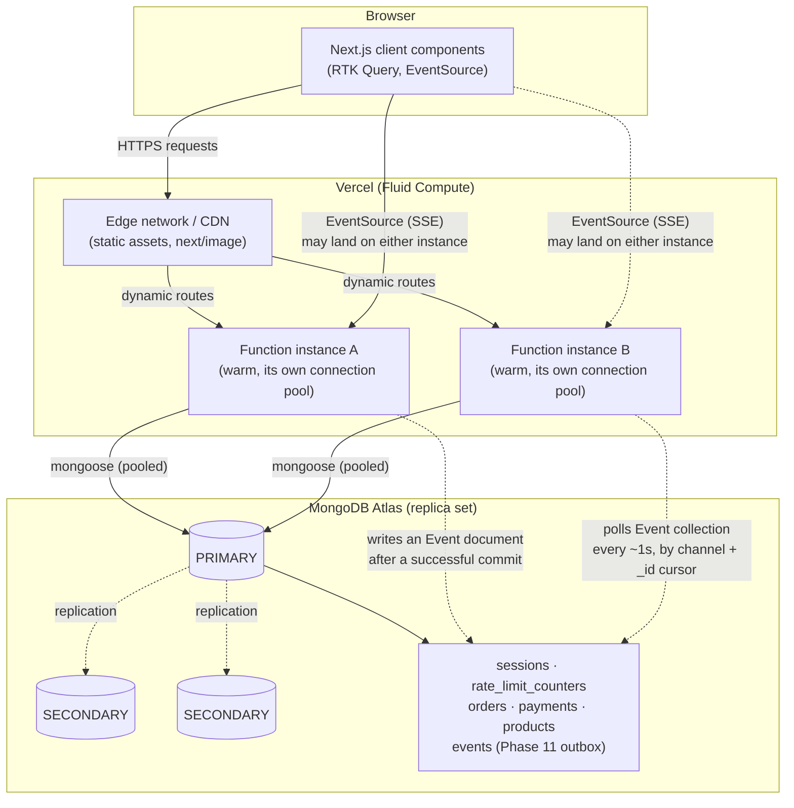

# Production Readiness — Architecture Decision Record

**Status:** Phase 11 closure. This document describes the architecture this
codebase actually implements today, plus explicit, evidence-based decisions
about what is deliberately NOT implemented and why. It never describes a
planned mechanism as already deployed. Every claim below is either backed
by code in this repository or explicitly marked as requiring live
verification against the real Vercel/Atlas deployment (see the PENDING
gates list at the end).

## 1. Deployment platform

Confirmed production platform: **Vercel** (`tahostore.vercel.app`, see
`.env.example`'s client-IP-trust section). This app runs as Next.js 16.3.4
App Router Route Handlers — no custom Node/Express server, no Nginx, no
custom load balancer.

## 2. Architecture classification table

| Concern | Mechanism | Where in this repo |
|---|---|---|
| Load balancing | Vercel-managed (automatic, platform-level) — no custom LB, no sticky sessions | N/A — see §3 |
| Compute scaling | Vercel Fluid Compute — reuses warm function instances across concurrent requests, not one-request-per-instance | Platform-level; `config/db.js`'s pool settings are tuned for this model |
| Function region | Single region, wherever the Vercel project is configured (not pinned in code) | See §4's region-alignment checklist |
| CDN | Vercel's edge network (static assets, `next/image` output) | Platform-level |
| App-level cache | `unstable_cache` + `revalidateTag`, MongoDB-backed data reads (Phase 8) | `lib/serverDataCache.js`, `lib/cacheInvalidation.js`, `lib/cacheTags.js` |
| Private/session state | MongoDB-backed, never in-memory/process-local | `models/sessionModel.js`, `lib/session.js` |
| Sessions | Opaque random tokens, MongoDB-backed, HttpOnly/Secure/SameSite cookie | `lib/session.js`, `lib/cookies.js` |
| Rate limiting | MongoDB-backed counters, shared across every instance | `models/rateLimitModel.js`, `lib/rateLimit.js` |
| Idempotency | Partial unique index on `{user, idempotencyKeyHash}` | `models/orderModel.js`, `lib/idempotency.js` |
| Realtime (SSE) | MongoDB-backed durable event outbox + bounded polling (Phase 11 rewrite — replaces the old process-local EventEmitter) | `models/eventModel.js`, `lib/events.js`, `app/api/admin/events/route.js`, `app/api/orders/[id]/events/route.js` |
| Queue/broker | None installed — evidence-based "not required yet" decision | See §9 (section J) |
| DB topology | MongoDB replica set (transaction-capable); Atlas in production (assumed, requires live confirmation — see PENDING gates) | `config/db.js`, `scripts/checkReplicaSetReadiness.mjs` |
| Sharding | Not sharded — replica set is sufficient at current scale; explicit future thresholds documented (§8) | N/A |
| Backups | Atlas continuous backup / PITR (requires live Atlas configuration — PENDING) | See §11 |
| Monitoring | Structured JSON logs with request-ID correlation (Phase 11); no external APM/tracing SDK installed | `lib/logger.js` |
| Deployment | Vercel Git-integration preview + production promotion (manual runbook, §12) | N/A |

## 3. Load-balancer decision

**Decision: no custom load balancer, no sticky sessions, no custom Nginx.**
Vercel provides load balancing and concurrency scaling at the platform
level for every deployed Function; building a custom layer on top would
duplicate what the platform already does and add a maintenance burden with
no benefit.

This decision is safe specifically because **no per-instance state that
would require sticky sessions exists anywhere in this app**:

- **Sessions** are opaque tokens validated against MongoDB on every
  request (`lib/session.js`'s `validateSessionToken`) — any instance can
  validate any session, because the state lives in the shared database,
  not in that instance's memory.
- **Rate limits** are MongoDB-backed counters (`models/rateLimitModel.js`)
  — a client's 3rd request landing on a different instance than their 1st
  and 2nd still sees the correct count.
- **Idempotency** keys are enforced via a MongoDB partial unique index,
  not an in-memory dedup map — two concurrent requests with the same key
  landing on two different instances still race safely at the database
  layer (`services/orderService.js`'s `createOrder`, guarded by the unique
  index and a duplicate-key catch).
- **Realtime (SSE)** was the one exception before Phase 11 — the old
  `lib/events.js` EventEmitter WAS process-local state that would have
  required sticky sessions to work correctly across instances. This was
  identified as a **mandatory correction** and rewritten (§7) specifically
  so this "no sticky sessions needed" claim holds for the whole app, not
  just most of it.

## 4. Region alignment checklist

Requires live confirmation against the real Vercel project + Atlas cluster
(cannot be verified from this repository alone — PENDING, see the gates
list). The checklist itself, to run once during/after deployment:

1. Identify the Vercel project's configured Function region(s) (Vercel
   dashboard → Project Settings → Functions → Region).
2. Identify the Atlas cluster's region (Atlas dashboard → cluster
   overview) — **never** by printing/inspecting `MONGO_URI`'s host
   directly in any log or script output; read it from the Atlas dashboard
   instead.
3. Confirm they match (or are in the same or an adjacent, low-latency
   region pair). A Function and its database in different regions adds
   real per-request latency to every single DB-backed route, since almost
   every route here touches MongoDB.
4. Confirm this only needs checking once per deployment/region change,
   not per-request — nothing in this codebase re-resolves region at
   request time.

## 5. Function-duration inventory (long-lived / SSE routes)

| Route | Nature | Self-imposed close time | Reasoning |
|---|---|---|---|
| `app/api/admin/events/route.js` | SSE stream (admin broadcast) | 4 minutes (`STREAM_MAX_MS`) | Well under Vercel's 300s default function timeout; EventSource auto-reconnects, so a periodic clean close is invisible to the user and avoids ever being cut off mid-frame by the platform |
| `app/api/orders/[id]/events/route.js` | SSE stream (one order) | 4 minutes (`STREAM_MAX_MS`) | Same reasoning |
| Every other route | Ordinary request/response, no streaming | N/A | Bounded by normal request latency; nothing else in this app holds a connection open |

Live verification still required: confirm the actual configured Vercel
function-duration limit for this project (default vs. a raised limit) and
confirm 4 minutes stays comfortably under it — PENDING.

## 6. MongoDB production readiness

### 6.1 Connection pooling (`config/db.js`)

Explicit settings added in Phase 11 (previously relied entirely on driver
defaults):

- `maxPoolSize: 20` — sized for Vercel Fluid Compute's model: each warm
  function instance holds its OWN cached connection+pool
  (`globalThis.__mongooseCache`) for as long as it stays warm, so the
  right sizing question is "how many concurrent in-flight requests can
  ONE warm instance have," not "what's the app's total traffic." Formula:
  `(Atlas cluster's connection limit) / (expected concurrent warm
  instances) with headroom` — 20 is a conservative starting point that
  also leaves headroom for several concurrently-open SSE streams each
  polling the durable event outbox roughly once per second (§7); raising
  it further requires real Atlas connection-count evidence (Atlas's own
  metrics), not speculation. (An initial value of 10 was tried first;
  this repo's own local HTTP-integration harness — which, unlike a real
  multi-instance deployment, funnels every test file's DB traffic through
  ONE shared pool — showed rare intermittent test-timing flakiness at 10
  under its own concurrent load/SSE tests, and none across repeated runs
  at 20. That evidence is specific to this local single-pool harness, not
  a claim about real Atlas connection limits, but it was still the
  concrete signal that pushed the default from 10 to 20.)
- `minPoolSize: 0` — a cold instance should not pay to hold idle Atlas
  connections open.
- `serverSelectionTimeoutMS` / `connectTimeoutMS`: 5000ms each — bounds a
  genuinely unreachable database to a fast, clear failure instead of
  hanging until the platform's own duration limit kills the request.

### 6.2 Transaction/replica-set readiness

`scripts/checkReplicaSetReadiness.mjs` — a read-only check (never writes)
confirming the configured MongoDB deployment is a replica set (or mongos)
with a reachable PRIMARY, since this app's multi-document transactions
(order creation, COD payment creation, order cancellation, guarded stock
decrement, atomic coupon claims — all via `session.withTransaction` in
`services/orderService.js`/`services/paymentService.js`) simply cannot run
against a standalone `mongod`.

### 6.3 Index audit

`scripts/auditIndexes.mjs` — safe, idempotent, dry-run-by-default audit of
every production-critical index across `Session`, `RateLimit`, `Order`,
`Payment`, `CouponUsage`, `Product`, and `Review`. Uses `createIndexes()`
only (never `syncIndexes()`, which can drop indexes) and was tested twice
in immediate succession against a disposable replica set during this
phase, confirming idempotency (second run reports zero drift after the
first `--ensure` run). All of these indexes are also declared directly on
their models' schemas, so Mongoose's own `autoIndex: true` default already
builds them automatically on first connect in any deployment that hasn't
explicitly disabled that — this script exists for deployments that HAVE
disabled it.

## 7. Distributed realtime (mandatory correction)

**Before Phase 11:** `lib/events.js` was a process-local Node
`EventEmitter`. This is broken under Vercel Fluid Compute by construction:
multiple isolated function instances share no process memory, so an event
emitted in the instance that handled the write is invisible to a client
whose SSE connection happens to be held open by a different instance.

**After Phase 11:** a MongoDB-backed durable event outbox
(`models/eventModel.js`) replaces it. `lib/events.js` keeps the exact same
public function names (`emitOrderEvent`, `emitAdminEvent`, `orderChannel`,
`ADMIN_CHANNEL`).

**Realtime-durability correction (post-initial-Phase-11-commit):** the
first version of this rewrite made every event write an un-awaited
`.catch(() => {})` fire-and-forget call. On a serverless platform this is
a real durability gap, not a style issue: a Vercel Function can return its
response and have its instance frozen before an un-awaited promise
settles, so the event write might never actually happen even though the
business mutation succeeded — and swallowing the failure silently removed
all operational visibility into a lost event. This was corrected by
classifying all 10 real call sites (not 8 — the original count was
wrong) into two groups:

- **Transactional outbox (3 mutations: order creation, order
  cancellation, COD payment creation).** The event document is now
  inserted *inside* the same `session.withTransaction(...)` block as the
  business mutation, via `emitOrderEvent(...)`/`emitAdminEvent(...)`'s
  optional `{ session }` parameter. This is a genuine transactional
  outbox for these three: a forced event-insert failure rolls back the
  whole transaction (order/stock/coupon/cart writes included — proven in
  `tests/eventDurabilityAtomicity.test.mjs`), and a successful transaction
  commits the mutation and its event atomically, in the same instant.
  Nothing extra is needed to "expose the event after commit" — the SSE
  routes only ever see data through an independent read (`readEventsSince`
  polling), and MongoDB transactions are invisible to other readers until
  they commit, so this property is automatic.
- **Non-transactional, best-effort (7 sites: low-stock alerts, order
  status changes with no surrounding transaction, product create/update,
  new-review admin notification).** These mutations are single-document
  writes or have no transaction to join. Each event write is now awaited
  via `emitBestEffort()` before the calling function returns — so a
  failure is guaranteed to be observed and logged (`lib/logger.js`'s
  `logEvent`, no secrets, no stack trace in the structured line) before
  the response returns, never silently lost to a frozen/recycled function
  instance — but a failure here does NOT roll back or fail the
  already-succeeded business mutation, since every one of these event
  types has a documented, low-severity, self-healing loss consequence
  (§9's async-work table): a live admin/customer view stays stale until
  the next poll/refresh, nothing is ever silently wrong.

**Background-execution API audit:** this app does not use `waitUntil()`,
Next.js's `unstable_after()`, or any other background-execution API
anywhere in the codebase — confirmed by a full source grep. The only
`@vercel/functions` import (`ipAddress()` in `lib/clientIp.js`, version
3.9.5 per `package.json`) is for client-IP resolution, unrelated to
background execution. Background execution is deliberately NOT used as a
substitute for the transaction atomicity above — the atomicity guarantee
comes entirely from the MongoDB transaction itself, which is durable
across a function instance being frozen or recycled at any point.

**Change Streams vs. bounded polling — the required comparison:** MongoDB
Change Streams were considered and rejected for now. They require a
persistent server-side cursor/oplog-tailing connection per subscriber and
introduce their own failure modes (resume-token invalidation, cursor
timeouts) — justified at a scale with many concurrent long-lived
subscribers or a genuine need for sub-second latency. This app's real
usage (a handful of admin dashboards, individual customers watching their
own order) is small enough that a 1-second bounded poll against an
indexed `{channel, _id}` query is simpler, shares the same failure mode as
every other query in the app, and costs one small indexed query per second
per open stream. Reconsider only with real evidence of high concurrent
open-stream volume — not speculatively.

**Guaranteed properties (each with a mandatory cross-process test — see
§13 and `tests/http/multiInstanceEvents.integration.test.mjs`):**

- Cross-instance visibility: an event committed via one real server
  process is delivered to a stream held open by a genuinely separate
  process (proven, not asserted).
- Permission protection preserved: unauthenticated and non-owner requests
  are rejected before the stream opens, identically to before.
- Minimal payloads: unchanged from before — the event schema doesn't
  change what data any call site was already sending.
- Events only after successful commits: for the 3 transactional call
  sites, this is now a hard guarantee, not just an ordering convention —
  the event is part of the same transaction as the commit itself (proven
  in `tests/eventDurabilityAtomicity.test.mjs` by forcing the event
  insert to fail and confirming the business mutation rolls back too).
  For the 7 non-transactional sites, the write is awaited via
  `emitBestEffort()` and always happens strictly after the mutation that
  already succeeded (see the realtime-durability correction above).
- No duplicate events on idempotent replay: proven directly, both via
  mocked call-count evidence (`tests/orderPostCommitEffects.test.mjs`) and
  real-database document counts for sequential AND concurrent replay
  (`tests/eventDurabilityAtomicity.test.mjs`) — a replayed
  `Idempotency-Key` request returns the same order without inserting a
  second `NEW_ORDER` event document.
- `Last-Event-ID` resume: the server emits `id: <mongoId>` per SSE frame;
  the browser's native `EventSource` tracks and resends it automatically
  on reconnect; the server's `resolveStartCursor()` honors it with a
  strict `_id > lastSeenId` query, so a resumed connection never
  redelivers an already-seen event.
- TTL expiry: `expiresAt` (10 minutes) with `index: { expires: 0 }`,
  matching the exact pattern already used by `Session`/`RateLimit`.
- Heartbeats: unchanged `: ping\n\n` comment every 25s, carrying no data.
- Streams close before the configured Vercel duration: self-imposed 4-minute
  close (§5).
- Client-side dedup: both hooks (`hooks/useAdminEventStream.js`,
  `hooks/useOrderStatusStream.js`) track a small bounded set of recently
  seen `lastEventId` values as defense-in-depth on top of the server's own
  guarantee.

`lib/events.js` was **not** removed — it remains the module's name, fully
repurposed to the new durable implementation, since every call site still
imports it and it is not dead code.

## 8. Sharding decision

**Decision: not sharded. Replica set + backups + monitoring + indexes +
a documented scale-up path, not a missing feature.**

Concrete risk factors that make sharding a bad default choice right now,
not merely an unnecessary one:

- **Multi-document order transactions**: order creation, COD payment
  creation, cancellation, and stock decrement all run inside
  `session.withTransaction`. A sharded cluster can still run
  multi-document transactions, but cross-shard transactions carry
  materially higher latency and a more complex failure surface than a
  single replica set — a real cost this app's current traffic does not
  justify paying.
- **No natural shard key**: none of `Order`, `Product`, `User`, etc. has
  an obvious, evenly-distributing shard key that also keeps
  transaction-scoped documents (e.g. an order and the stock decrements it
  triggers) co-located — choosing a bad shard key is far worse than not
  sharding at all, and is expensive to change later.
- **Atlas conversion is not reversible**: converting an Atlas replica set
  to a sharded cluster cannot be undone by simply reverting a
  configuration flag — this is a one-way architectural commitment, not a
  toggle to experiment with.

**Explicit future thresholds** (any of these being true is the trigger to
re-evaluate, not sharding pre-emptively):

- Working-set size or write throughput approaching the practical ceiling
  of the largest single Atlas replica-set tier this app is willing to pay
  for.
- Read/write latency on core collections (`orders`, `products`) measurably
  degrading under real production load even after standard optimization
  (index review, read-scaling via replica reads where safe).
- A genuine multi-region write requirement that a single replica set
  cannot serve acceptably.

## 9. Async / background work inventory (section J)

| Work | Must complete before response? | Retried on failure? | Idempotency key needed? | Duplicate/loss consequence | Current volume | Queue required now? |
|---|---|---|---|---|---|---|
| Password-reset email | No (fire-and-forget in practice via nodemailer's own promise; caller doesn't block the enumeration-safe response on it) | No | No — token itself is single-use | Loss: user doesn't get the email, requests another (low friction). Duplicate: harmless, just two identical emails | Low | No |
| Admin notification (DB write) | No | No | No — a missed notification is a UX gap, not a correctness bug | Loss: an admin doesn't see a bell notification (recoverable — the underlying data is still correct and visible in the relevant list page) | Low-medium | No |
| Order/admin realtime events (Phase 11 outbox) | No | No (next poll cycle just sees the next real state) | Implicitly, via the same idempotency key that guards the underlying order/payment operation | Loss: a client's live view is stale until their next poll tick or manual refresh (never wrong data, just delayed) | Low-medium | No |
| Low-stock check | No | No | No — re-checking stock is idempotent by nature (it's a read against current state) | Loss: a low-stock alert is delayed until the next order touches that product | Low | No |
| Cache invalidation (`revalidateTag`) | No (called after the response-relevant work, fire-and-forget) | No | N/A — invalidation is idempotent (tagging a cache key as stale twice is a no-op) | Loss: stale cache read until the tag's own TTL expires (Phase 8's existing guarantee) | Low-medium | No |
| Session/rate-limit TTL cleanup | N/A (MongoDB's own background TTL monitor, not application code) | N/A | N/A | N/A | N/A | No |

**Conclusion: no message queue/broker required at this app's current
scale.** Every asynchronous unit of work above is either safely
fire-and-forget (its failure has a low-severity, self-healing consequence
already documented) or backed by MongoDB's own durable guarantees
(TTL indexes, unique-index idempotency). No queue/broker (Vercel Queues or
otherwise) is installed, and none should be added without explicit
authorization.

**Explicit future adoption thresholds** — reconsider only if one of these
becomes true:
- A background job's failure would need automatic retry with backoff that
  fire-and-forget + "next request/poll heals it" can no longer cover (e.g.
  a genuinely money-affecting operation that MUST eventually succeed, not
  just eventually be re-observed).
- Real operational evidence of email delivery failures going unnoticed at
  a volume that matters (right now, delivery failures are invisible by
  design — the enumeration-safety requirement means the API never signals
  send failure to the client either).
- A new async workload is added whose consequence-of-loss is high (e.g. a
  payment-provider webhook that must not silently drop).

## 10. Cache guarantees reconfirmation (section K)

Phase 8's caching guarantees (`unstable_cache` + `revalidateTag`,
`lib/serverDataCache.js`) are unchanged by Phase 11 — no cached data path
was touched by this phase's work.

**Local vs. live verification split** (documented, not re-tested here —
Phase 8 already established local behavior; the split below is about what
still needs confirming against the REAL deployed environment):

- Verifiable locally (already proven in Phase 8/10's own test suites): tag
  invalidation correctness, TTL expiry timing, that a write-path mutation
  calls `invalidateCacheTags()` for the right tags.
- Requires live verification (cannot be proven from a local `next start`
  process alone — PENDING): whether Vercel's own data-cache persistence
  behaves identically to local disk-backed `.next/cache` across multiple
  deployed instances and across a redeploy; whether the CDN layer in front
  of a Vercel deployment caches any of these responses at an additional
  layer this app's own tags don't reach.

**Safe (not executed) preview verification procedure**, for a future
manual pass against a real Preview deployment: (1) load a page backed by a
cached read, note the response; (2) perform the admin mutation that should
invalidate that tag; (3) reload the same page within a few seconds and
confirm the updated data appears; (4) repeat once more after redeploying
the same Preview, to confirm invalidation survives a redeploy. This
procedure is deliberately read/write-safe against a Preview environment
only — it is not run against production, and it is not run as part of
this phase's automated evidence.

## 11. Backup / PITR plan and restore drill (section P)

**Plan (requires live Atlas configuration — PENDING, not yet executed):**
Enable Atlas's continuous backup with point-in-time recovery (PITR) on the
production cluster. Continuous backup captures oplog entries continuously
between periodic snapshots, allowing restoration to any point in time
within the configured retention window — not just to a snapshot boundary.

**Restore-drill procedure (to run against a throwaway Atlas project/
cluster, never over production):**

1. Provision a separate, temporary Atlas cluster (or use Atlas's own
   "restore to a new cluster" flow, which never touches the source
   cluster).
2. Trigger a PITR restore to a specific timestamp a few minutes in the
   past, targeting ONLY the temporary cluster.
3. Connect `scripts/checkReplicaSetReadiness.mjs` (or a manual `mongosh`
   session) to the restored temporary cluster and confirm: expected
   collections exist, a spot-checked document matches what was known to
   be true at that timestamp, index definitions match
   `scripts/auditIndexes.mjs`'s expectations (run it in dry-run mode
   against the restored cluster).
4. Tear down the temporary cluster once the drill is confirmed.
5. Record the actual wall-clock time the restore took — this becomes the
   evidence basis for the RTO figure below, not a guess.

**Proposed (non-contractual) RPO/RTO — requires owner approval, not a
commitment made by this codebase:**
- RPO target: a few minutes (bounded by Atlas continuous backup's oplog
  capture granularity) — pending confirmation via the drill above.
- RTO target: however long step 2-4 above actually takes in a real drill,
  plus DNS/environment-variable cutover time if promoting the restored
  cluster to production — not yet measured.

## 12. Incident-response plan (section P) and deployment/rollback runbook (section Q)

### Incident response

**Severity levels:**
- **SEV1** — production down or data-integrity risk (e.g. payment/order
  data corruption, auth bypass). Immediate response.
- **SEV2** — a significant feature broken (e.g. checkout failing for a
  subset of users, realtime events not delivering) but the app is
  otherwise usable.
- **SEV3** — a minor, non-blocking issue (e.g. a cosmetic bug, a slow but
  functioning endpoint).

**Detection:** Vercel's own deployment/function error rate (dashboard),
Atlas's own cluster health alerts (§13 below — recommended, not yet
configured), and user/support reports.

**Triage:** confirm severity, confirm blast radius (one route? every
route? one region?), check `/api/health/ready` and `/api/health/live`
first — they distinguish "the app process is fine but the database is
degraded" from "the app itself is down."

**Containment:** for a bad deploy, roll back via Vercel's instant rollback
to the last known-good production deployment (§12's rollback runbook
below) rather than attempting a forward-fix under pressure.

**Credential rotation:** if a credential (Mongo URI, Cloudinary secret,
SMTP password) is suspected compromised, rotate it in the real secrets
store (Vercel environment variables / Atlas database user) and redeploy —
this codebase never hardcodes a credential, so rotation is purely an
ops/dashboard action, not a code change.

**Rollback:** see the deployment runbook below.

**DB recovery:** see §11's restore-drill procedure.

**Communication owner:** not specified in this codebase — this is an
organizational decision for whoever owns the real production deployment,
not something this document fabricates a name/role for.

**Post-incident review:** a short written summary (what happened, what
was the trigger, what was the fix, what would have caught it sooner) —
process, not code; no template is prescribed here.

### Deployment / rollback runbook

**Before-preview checklist:**
1. `npm run lint` — 0 problems.
2. `CI=true REQUIRE_TEST_DB=true npm run test:core` — all pass.
3. `CI=true REQUIRE_TEST_DB=true npm run test:http` — all pass (this
   itself runs `npm run build` first via its `pretest:http` hook).
4. `npm run validate:production` — 0 problems, run with the REAL target
   environment's variables loaded (never with test/local values).
5. `npm audit --omit=dev` — no new unaddressed vulnerabilities since the
   last review.

**Preview verification steps** (once Vercel's Git integration produces a
Preview URL):
1. Confirm `/api/health/live` and `/api/health/ready` both return 200.
2. Manually verify the specific feature(s) this deploy changes.
3. Run `scripts/smokeDeployment.mjs` (read-only mode) against the Preview
   URL.
4. If this deploy touches cache-tagged data, run §10's cache verification
   procedure against the Preview.

**Production promotion steps:**
1. Promote the verified Preview deployment to Production via Vercel's
   "Promote to Production" action (never a fresh production build from a
   possibly-different commit).
2. Re-run `/api/health/ready` and `/api/health/live` against the real
   production URL.
3. Watch Vercel's function error-rate dashboard for a few minutes.

**Rollback steps:**
1. Vercel Dashboard → Deployments → select the last known-good production
   deployment → "Promote to Production" (Vercel's instant rollback — no
   rebuild required).
2. Confirm `/api/health/ready` on production afterward.
3. If the bad deploy included a destructive DB migration/index change,
   rolling back the app code does NOT roll back the database — that
   requires the restore-drill procedure (§11) or a manually reasoned
   forward-fix, decided case-by-case; this codebase has no destructive
   migrations as of this phase (`scripts/auditIndexes.mjs` and
   `scripts/ensureOrderIdempotencyIndex.mjs` are both additive-only).

## 13. Recommended (not configured) monitoring/alerts

Documented only — nothing below is wired up by this phase, since doing so
requires access to the real Vercel/Atlas dashboards this codebase cannot
reach:

- Vercel: function error-rate alert, function duration p95/p99 alert
  (catches an SSE stream or any route trending toward the platform's
  duration limit), deployment-failure notification.
- Atlas: cluster CPU/connection-count alerts (validates the pool-size
  formula in §6.1 against real numbers), replica-set-elections alert
  (signals instability), disk-usage alert.
- Application-level (via the structured logs `lib/logger.js` now emits):
  an aggregation/alerting rule on `category: "DEPENDENCY_UNAVAILABLE"` or
  `category: "TIMEOUT"` log events trending upward — these are exactly the
  categories `/api/health/ready` failures and rate-limit-store outages
  fall into.

## 14. Live-verification gates — PENDING

None of the following may be marked PASS from local evidence alone. Every
one requires an action against the real, live Vercel/Atlas deployment:

1. Vercel Function region matches Atlas cluster region (§4).
2. Vercel project's actual configured function-duration limit, confirmed
   ≥ the 4-minute self-imposed SSE close time (§5).
3. Atlas cluster is confirmed to be a genuine replica set (not a
   standalone instance) — run `scripts/checkReplicaSetReadiness.mjs`
   against the real production `MONGO_URI`.
4. `npm run validate:production` run against the REAL production
   environment variables (never against `.env.test`/local values).
5. `scripts/auditIndexes.mjs` run (dry-run first) against the real
   production database.
6. Atlas continuous backup / PITR actually enabled on the production
   cluster.
7. A real restore drill executed against a temporary Atlas cluster (§11),
   with actual timing recorded.
8. `scripts/smokeDeployment.mjs` executed against a real Preview
   deployment URL.
9. `scripts/smokeDeployment.mjs` executed against the real production URL
   post-promotion.
10. Cache verification procedure (§10) executed against a real Preview
    deployment.
11. Vercel function error-rate/duration alerts actually configured (§13).
12. Atlas cluster health alerts actually configured (§13).
13. A real multi-region latency check, if the production Vercel project
    ever spans more than one Function region.
14. Confirmation that `TRUST_PROXY_HEADERS`/`TRUSTED_PROXY_HOP_COUNT` are
    correctly left unset in the real Vercel production environment (Vercel
    IP resolution is automatic — see `.env.example`'s client-IP-trust
    section — these must NOT be set there).
15. A real rollback executed at least once (even in a Preview/staging
    context) to confirm the runbook (§12) works as written, not just as
    designed.
16. SMTP credentials confirmed to actually deliver a real password-reset
    email end-to-end against the real production SMTP provider.

## 15. Architecture diagram

